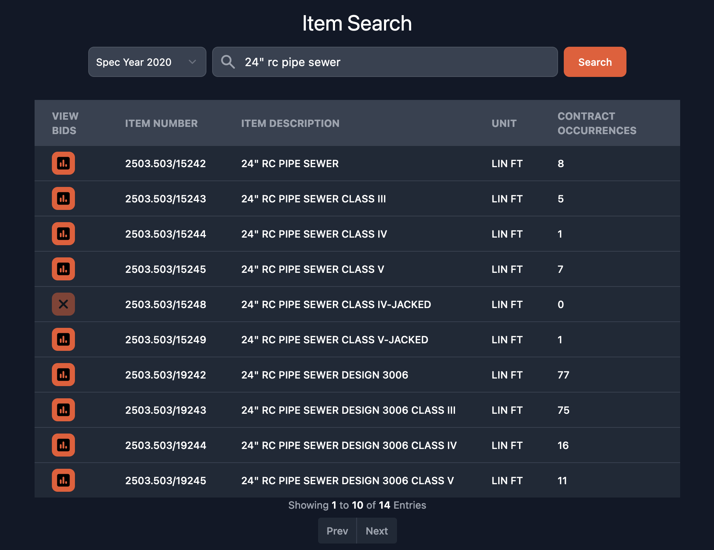

# [mndotbidprices.com](https://mndotbidprices.com)

*An analytics dashboard for exploring construction bids on Minnesota Department of Transportation (MnDOT) projects.*

## Introduction

Estimating the cost of a proposed construction project is often a difficult task for engineers. The factors impacting the cost of each unit of work are many and difficult to fully account for. Engineers often rely on cost data from past projects to inform their estimates. Sources such as MnDOT's own [Average Bid Price](https://edocs-public.dot.state.mn.us/edocs_public/DMResultSet/Urlsearch?columns=docnumber,docname,app_id&folderid=28521650) documents help with this, but often leave the user wanting for more recent and detailed information.

This dashboard provides those recent and detailed insights by scraping data from individual [contract award abstracts](https://www.dot.state.mn.us/bidlet/abstract.html) and providing summary statistics computed from that data.

## Background

This repository is a complete redesign of a [FastAPI backend](https://github.com/depowered/mndot-bid-api) & [Dash Plotly frontend](https://github.com/depowered/mndot-bid-dash) version of the same dashboard. The redesign utilizes modern data techniques and UI frameworks to exceed previous functionality with much less code. Specific improvements include:

#### Decoupled frontend and backend

The frontend does not communicate directly with any server process created by the backend. Instead, the backend publishes source data as parquet files to an object storage bucket which the frontend reads from. This eliminates the need to deploy and maintain a backend server.

#### JavaScript UI frameworks greatly simplify deployment

Building the frontend with SvelteKit allows easy deployment on platforms like Cloudflare Pages, Netlify, or Vercel that publish builds when code is pushed to GitHub. This not only simplifies initial deployment, but enables previewing of development branches which greatly reduces the chance of pushing breaking changes to production.

#### Much faster dashboard

The dashboard uses a <a href="https://duckdb.org/docs/api/wasm/overview" target="_blank">web assembly build of DuckDB</a> to preform analytical SQL queries in the browser. The queries are ran against compressed parquet files that are lazy-loaded to local storage in the background. Once the files are loaded, queries execute at C-like speeds with zero network latency, returning results in tens of milliseconds.

## Usage

A hosted version of the dashboard is available at [mndotbidprices.com](https://mndotbidprices.com). See the dashboard's *Usage* section for detailed instructions for operating the application.

## Installation

The frontend and backend can be installed and hosted locally. There is no direct communication between the frontend and backend, so they do not need to be installed or ran concurrently. See the READMEs in the respective directories for installation instructions

[Frontend Installation](frontend/README.md#installation)

[Backend Installation](backend/README.md#installation)

## [License](LICENSE)

MIT &copy; 2023 [Devin Power](https://github.com/depowered)